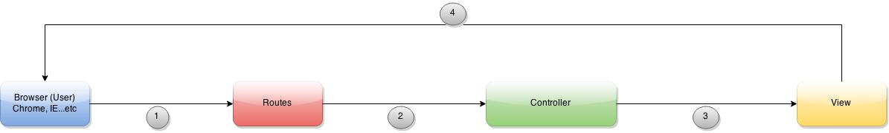

##The Basic MVC Framework
For the following session, we would start off with the simplist framework.

The Components:
 1. **User**
 2. **Routes** - Redirecting the user request
 3. **Controller** - Processes the user request
 4. **View** - Create content for user to see

How it works (think about Post Office):
 1. **User** enters "www.google.com/" in the browser. (Send a mail through Post Office)
 2. **Routes** check the link and redirect to the appropriate controller. (The Post Office will look at the address)
 3. **Controller** will do all the necessary actions and logics (Process the mail)
 4. **View** will send response back to browser. The response format can be in HTML or JSON (The recipent will receive and read the mail)

##Trying It Out
Set up Rails with the [following instructions](https://github.com/WDI-HK-7/rails-basic-template/blob/master/README.md)