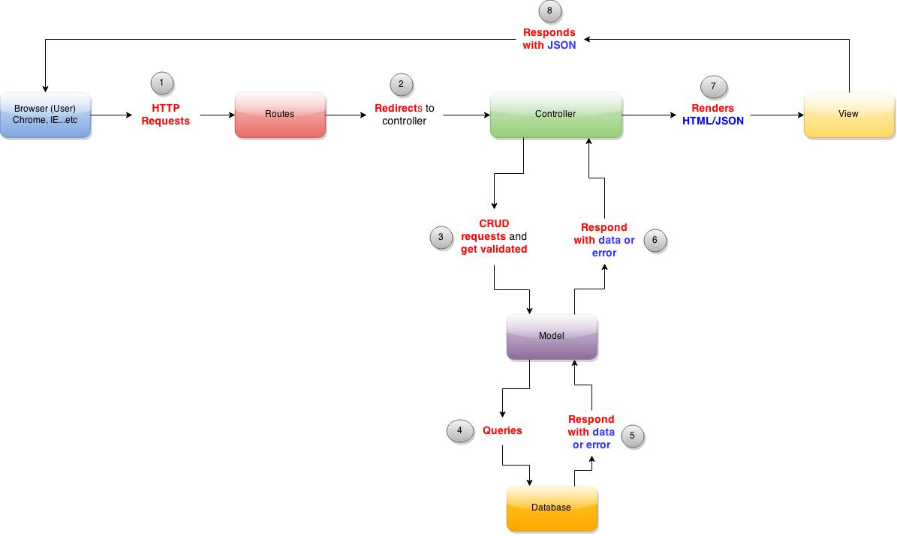

#MVC Framework With Database



###The Components:

1. **User**
2. **Routes** - Point the user request to the correct controller
3. **Controller** - Processes the user request
4. **Model** - Validates the data before querying the Database
5. **Database** - Contains all the data
4. **View** - Define response format (HTML/JSON or other formats)

###How it works:

1. **User** enters http://www.google.com/ in the browser.
2. **Routes** check the link and redirect to the appropriate controller.
3. **Controller** process request with predefined logics
4. **Model** check if the data meet all validation requirements
5. **Database** store, retrieve, modify, or delete data
6. **Model** responds controller with data.
7. **Controller** might further process data, generate the HTML/JSON and return data to the browser.
8. **View** defines how the HTML/JSON format

###Storing, retrieving, modifying and deleting data
- Migration file
- Model file

####Step 1: Generate model and migration files
In the Terminal, run `rails generate model post`

This should automatically generate both the model and migration file.

```
      invoke  active_record
      create    db/migrate/20150505012702_create_posts.rb
      create    app/models/post.rb
```

####Step 2: Create a new table
We are going to define that `posts` can have two columns, `title` and `content`.

Open the migration files
```
db > migrate > xxxxxxxx_create_posts.rb
```

In **xxxxxxxx_create_posts.rb**, add

```ruby
class CreatePosts < ActiveRecord::Migration
  def change
    create_table :posts do |t|
      t.string :title
      t.string :content
      t.timestamps null: false
    end
  end
end

```

Note that the column **id** is automatically generated.

####Step 3: Visualizing database
Download [PG Commander](https://eggerapps.at/pgcommander/)

Configurations for PG Commander:
- host: localhost
- port: 5432
- database: development

####Step 4: Migrate database
Running the migration to change the database schema. In Terminal, type `rake db:migrate`.

Check PG Commander

####Step 5: Adding a new migration
An important concept here is that if you need to modify the database schema, you have to do **one** of the following:
1. *generate* a new migration (this is recommended)
2. *rollback* an old migration, *modify* that migration file, and *migrate* again
3. *drop* the entire database, *modify* that migration files, and *migrate* again

For example, if you want to put a new `category` column to the table `post`, run `rails generate migration AddCategoryToPosts`

```
      invoke  active_record
      create    db/migrate/20150505015924_add_category_to_posts.rb
```

Open the migration files

```
db > migrate > xxxxxxxx_add_category_to_posts.rb
```

In **xxxxxxxx_add_category_to_posts.rb**, add

```ruby
class AddCategoryToPosts < ActiveRecord::Migration
  def change
    add_column :posts, :category, :string
  end
end
```

Running the migration to change the database schema. In Terminal, type `rake db:migrate`.

Check PG Commander

###Step 6: Access Rails console, which is also connected to the database
In iTerm, type `rails c`

###Step 7: Add and retrieving entries from database via Rails console
Try these commands in sequence one by one and pay attention to the results like the format. Is it an array? is it a hash? or something else?

Note that you always **capitalize** when refering to a table

```ruby
# List all the posts
Post.all

# Make a new post object, but doesn't save
Post.new

# Make a new post object with infomration, and save
post = Post.new(:title => "Reddit Sucks", :content => "Yeah, reddit really sucks")
post.save

# Make a new post object with infomration, and save
Post.create(:title => "Actually, I love Reddit", :content => "I just don't use it", :category => "Random")

Post.all
Post.first
Post.last
Post.find(1)
Post.find(2)
Post.find(3)
```

Notice the difference between **new** vs **create**?
**New** will make a new entry but **DOES NOT SAVE** to the database, while **create** will make a new entry and **SAVE** at the same time.

Check PG Commander for new entries.
