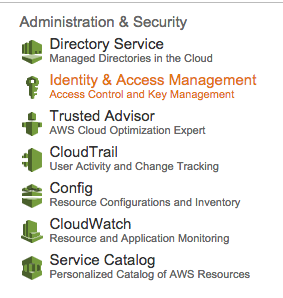
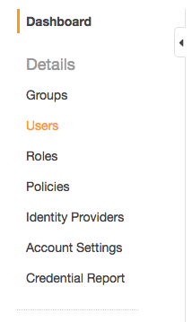
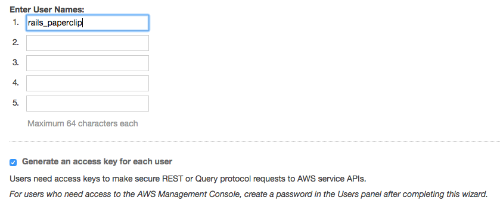
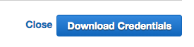
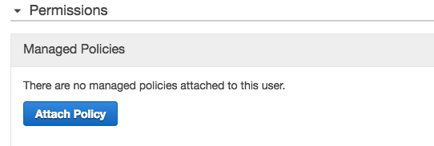
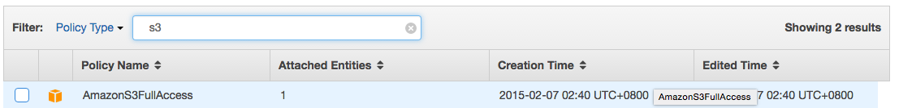
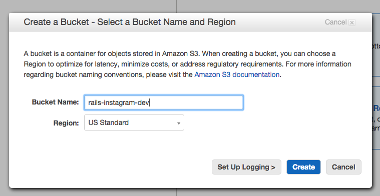

## File / Image Uploading
#### Using `paperclip` and `aws` to upload to AWS

##### 1. Configure AWS IAM

1.1 Configure Identity & Access Management (IAM) in S3



1.2 Add Users in IAM



1.3 Add one user name



1.4 Download the credentials for that user

This will download a csv file. We need to use the information inside in the final step.



1.5 Attach a policy to that user



1.6 Add S3 full access policy for that user



##### 2. Add a S3 Bucket

The name here is for reference only. It can be any name of your own choice.



##### 3. Add `aws-sdk` gem

Add these 2 lines in `Gemfile` and then run `bundle install`.

```ruby
gem 'aws-sdk-v1'
gem 'aws-sdk', '~> 2'
```

We need two gems here to work around a backward compatiability problem in the `aws-sdk` gem with AWS 2.0. You can read more about this in [this post](http://ruby.awsblog.com/post/TxFKSK2QJE6RPZ/Upcoming-Stable-Release-of-AWS-SDK-for-Ruby-Version-2). In particular, if you see the _infamous_ error **NameError (uninitialized constant Paperclip::Storage::S3::AWS)** in your Rails page, you have to use these 2 gems to fix it.

##### 4. Configure `config/environments/development.rb` and `config/environments/production.rb`

In both `config/environments/development.rb` and `config/environments/production.rb`, add the following. Please make sure you use your **own bucket name** in the configuration. The one showed here is just for reference.

```ruby
Rails.application.configure do
  ...

  config.paperclip_defaults = {
    :storage => :s3,
    :url =>':s3_domain_url',
    :path => '/:class/:attachment/:id_partition/:style/:filename',
    :s3_credentials => {
      :bucket => 'rails-instagram-dev',
      access_key_id: ENV['AWS_ACCESS_KEY_ID'],
      secret_access_key: ENV['AWS_SECRET_ACCESS_KEY']
    }
  }
end
```

##### 5. Configure local environment variables using `dotenv-rails`

Add a new gem in `Gemfile` **INISDE** the `group :development, :test do` block.

```ruby
group :development, :test do
  ..

  gem "dotenv-rails"

  ...
end
```

Create a file called `.env` in your project root folder to set **local** environment variables.

Then edit your project's `.gitignore` and add a line with contains `.env`. This is **VERY IMPORTANT** because we need to keep your AWS credentials in this file and you **DO NOT** want to share this with the whole wide world. 

In `.env`, add the following 2 lines where **YOUR_KEY_ID** and **YOUR_ACCESS_KEY** are placeholders. You should replace these placeholders with actual value from the credential CSV file you have downloaded from Step 1.4.

```
AWS_ACCESS_KEY_ID=YOUR_KEY_ID
AWS_SECRET_ACCESS_KEY=YOUR_ACCESS_KEY
```

To set **Heroku** environment variables, 

```
$ heroku config:set AWS_ACCESS_KEY_ID=YOUR_KEY_ID
$ heroku config:set AWS_SECRET_ACCESS_KEY=YOUR_ACCESS_KEY
```
