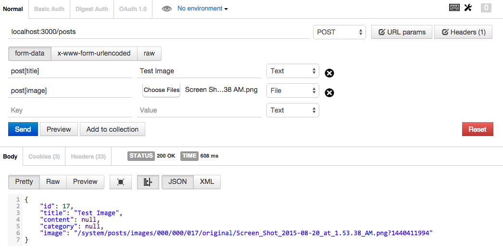
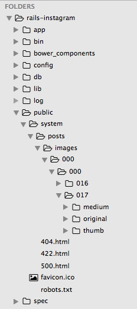

## File / Image Uploading
#### Using `paperclip` to upload locally

##### 1. Add `paperclip` gem

In `Gemfile`,

```
gem 'paperclip', '~> 4.3'
```

What do you do after modifying the Gemfile?

##### 2. Create migration files

`$ rails g migration AddImageToPosts`

In `db/migrate/xxx_add_image_to_posts.rb`,

```ruby
class AddImageToPosts < ActiveRecord::Migration
  def change
    add_attachment :posts, :image
  end
end
```

What do you do after configuring a migration file?

##### 3. Configure Paperclip in `Post` model

In `app/models/post.rb`,

```ruby
class Post < ActiveRecord::Base
  ...

  has_attached_file :image, styles: {
    medium: "300x300>",
    thumb: "100x100>"
  }

  validates_attachment_content_type :image, content_type: /\Aimage\/.*\Z/
end
```

##### 4. Allow `image` param in `Posts` controller

```ruby
class PostsController < ApplicationController
  ...

  private

  def post_params
    params.require(:post).permit(:title, :content, :category, :image)
  end
end
```

##### 5. Add image field in views

In `app/views/posts/create.jbuilder`,

```ruby
...

json.image @post.image
```

In `app/views/posts/index.jbuilder`,

```ruby
...

json.image post.image
```

##### 6. Test creating a post with file upload



##### 7. Find the location of the file uploaded to local storage


